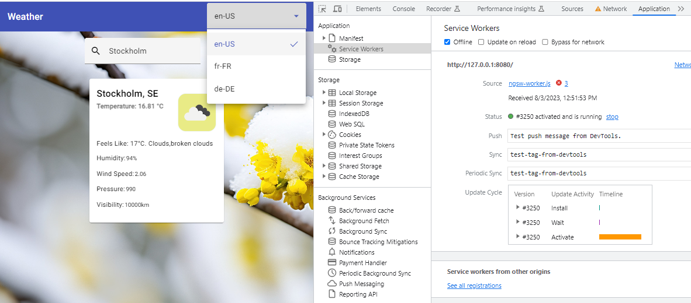
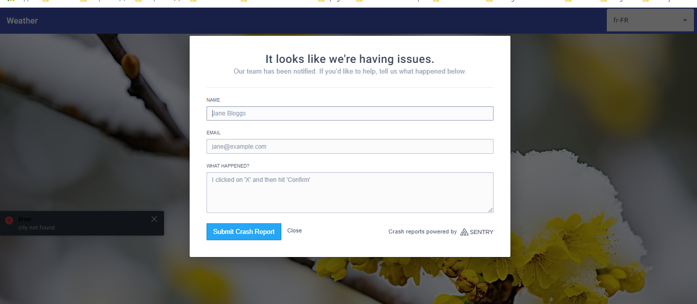

# weather.github.io

- This project was generated with [Angular CLI](https://github.com/angular/angular-cli) version 16.x
- Typescript 5.1
- [Ngrx](https://ngrx.io/guide/store) && [Rxjs](https://rxjs.dev/guide/overview)
- Styling with  [Angular Material](https://material.angular.io) based on SCSS
- Testing with Jasmin + Karma + jasmine-marbles

## Built With


[](https://www.typescriptlang.org/)
[](https://eslint.org/)


## Features

**All functionality*


| Function                   | Description                           | Implemention                                                                      |
| :------------------------- | :---------------------------------------------------------- | :------------------------------------------------------- |
| `Weather API Integration `  | Integrate with a weather API of your choice to fetch weather data.(openweather,...) Use RxJS Observables and operators to handle asynchronous data fetching.  | -Login to [openweathermap ref](-https://api.openweathermap.org) site and get an API KEY for getting data you pass it as params with url e.g. /data/2.5/weather?q={city}&&appid={API key}&units=metric     |
|  `Caching static files and data and Offline as well`     |   Implement caching mechanisms to reduce API requests and improve performance. Support offline functionality by caching previously fetched weather data.|   - Using Interceptor and capture request, ShareReplay rxjs , Servive Worker, pwa , and  configure Production Build with http-server [Help ref](https://medium.com/ngconf/angular-pwa-install-and-configure-858dd8e9fb07) |
| `Display Weather Data`        | Display the current weather information, including temperature, humidity, and weather condition. |        |
| `Search Functionality`       |  Implement an input field with a search button. Fetch and display the weather data for the searched city. |        |
| `ErrorHandling and Logging`    | Handle errors that may occur during API requests. Display appropriate error messages to the user. Integrate a logging service (e.g., Sentry) to log errors and exceptions. | - Create account and login to [Sentry ref](https://test-app-7v.sentry.io) site  - # Using npm (Angular 12+) npm install --save @sentry/angular-ivy - setting the sentry dsn , init the sentry in project , and register the sentry sonfig in provider of the module     - [Using Toast notify](https://github.com/scttcper/ngx-toastr)   |
| `StateManagement with NgRx`    | Use NgRx to manage the application state. Define actions, reducers, and effects to handle fetching weather data and updating the state accordingly. Use selectors to retrieve specific weather data from the state.| [NgRx ref](https://ngrx.io/guide/store)   |
| `UnitTesting and TestCoverage` | Write unit tests using Angular's testing frameworks (e.g., Jasmine, Karma). Aim for a high level of test coverage to ensure code reliability and maintainability. | [testing-code-coverage ref](https://angular.io/guide/testing-code-coverage)        |
| `Performance Optimization`              | Optimize the application's performance by lazy-loading modules, using code splitting, and optimizing network requests. Implement memoization techniques to cache expensive calculations and computations  |  |
| `Internationalization and Localization`  | Implement internationalization (i18n) and localization (l10n) support to provide multi-language support in the application.    | [ngx-translate ref](https://github.com/ngx-translate/core)     |
| `Responsive Design`      | Design and layout the application with a responsive and mobile-friendly interface. Ensure the application is visually appealing and usable on different screen sizes. |  |
| `Continuous Integration and Deployment`  | Deploy the application to a hosting platform on Netlify | [View Site](https://weather-task-angular.netlify.app/) - [Ref](https://www.programonaut.com/host-your-web-application-for-free-with-netlify-step-by-step/) - [Netlify](https://app.netlify.com/start/)|


## Development server

Run `ng serve` for a dev server. Navigate to `http://localhost:4200/`. The application will automatically reload if you change any of the source files.

## Code scaffolding

Run `ng generate component component-name` to generate a new component. You can also use `ng generate directive|pipe|service|class|guard|interface|enum|module`.

## Build

Run `ng build` to build the project. The build artifacts will be stored in the `dist/` directory.

## Running unit tests and test-coverage

```bash
  npm run test
  npm run test test-coverage
```


## Further help
Analyze statically the code to quickly find problems.

```bash
  npm run lint
  npm run lint:fix
```

Format the code with [Prettier](https://prettier.io/)

```bash
  npm run format
```

configure Production Build with http-server and run /dist/ on a server throght cli ( Testing offline mode)

```bash
  npm run start-pwa
```

## View(Demo) of project


