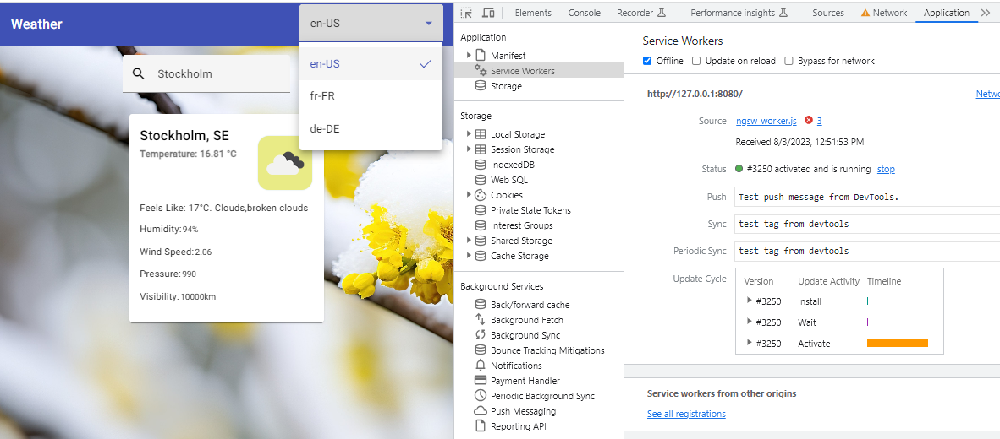
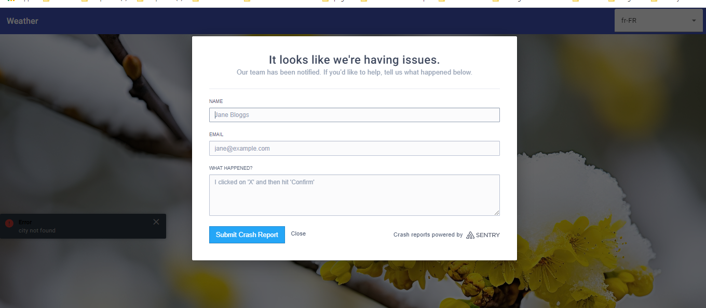

## Weather App

A weather application developed as a **Senior Angular Developer coding assignment** using **Angular**, **RxJS**, and **NgRx**.

The project fetches real-time weather data from the **OpenWeather API**, allows users to search by city, displays current weather conditions, and includes performance optimizations such as caching, offline support, internationalization, and centralized error logging.

---

## Built With


[](https://www.typescriptlang.org/)
[](https://ngrx.io/guide/store)
[](https://rxjs.dev/)
[](https://material.angular.io)
[](https://angular.io/guide/service-worker-intro)
[](https://github.com/ngx-translate/core)
[](https://sentry.io/)
[](https://eslint.org/)
[](https://jasmine.github.io/)
[](https://karma-runner.github.io/)
[](https://weather-task-angular.netlify.app/)

---

## Features

### **Assignment Requirements**

| Function | Description | Implementation |
| :------- | :---------- | :------------- |
| `Weather API Integration` | Fetch weather data from a public weather API using RxJS Observables and operators. | Integrated with [OpenWeather API](https://api.openweathermap.org). API key is passed as query parameter, e.g. `/data/2.5/weather?q={city}&appid={API_KEY}&units=metric` |
| `Caching and Offline Support` | Reduce API requests and support offline functionality by caching previously fetched data. | Implemented using **HTTP interceptor**, **RxJS shareReplay**, **Angular Service Worker**, and **PWA build configuration** |
| `Display Weather Data` | Show current weather information including temperature, humidity, and weather condition. | Implemented in dedicated weather UI components |
| `Search Functionality` | Search weather data by city name through an input field and search action. | Implemented using Angular forms and NgRx state flow |
| `Error Handling and Logging` | Handle API errors gracefully and log exceptions using an external service. | Integrated **Sentry** for error monitoring and **ngx-toastr** for user notifications |
| `State Management with NgRx` | Manage application state using actions, reducers, effects, and selectors. | Implemented using **@ngrx/store**, **@ngrx/effects**, and selectors |
| `Unit Testing and Test Coverage` | Ensure code quality and reliability with tests. | Implemented using **Jasmine**, **Karma**, and **jasmine-marbles** |
| `Performance Optimization` | Improve performance through caching, optimized requests, and maintainable architecture. | Implemented with request caching, memoized selectors, and modular structure |
| `Internationalization and Localization` | Support multiple languages in the application. | Implemented with **ngx-translate** |
| `Responsive Design` | Ensure usability across mobile, tablet, and desktop screens. | Built with responsive Angular Material UI and SCSS |
| `Continuous Integration and Deployment` | Deploy the app to a public hosting platform. | Deployed on **Netlify** → [View Site](https://weather-task-angular.netlify.app/) - [Ref](https://www.programonaut.com/host-your-web-application-for-free-with-netlify-step-by-step/) - [Netlify](https://app.netlify.com/start/) |

---

## API Reference

| API Name | Method | Reference |
| :------- | :----- | :-------- |
| `OpenWeather Current Weather API` | `GET` | [Ref](https://api.openweathermap.org) |

### API Key

To use the weather API:

- Create an account at [OpenWeather](https://openweathermap.org/)
- Generate an API key
- Use the key in requests like: /data/2.5/weather?q={city}&appid={API_KEY}&units=metric
---

## Run Locally

| Function | Description |
| :------- | :---------- |
| `npm install` | Install dependencies |
| `ng serve` | Start development server at `http://localhost:4200/` |
| `ng build` | Build the project |
| `npm run test` | Run unit tests |
| `npm run test-coverage` | Run test coverage report |
| `npm run lint` | Analyze code with ESLint |
| `npm run lint:fix` | Fix lint issues automatically |
| `npm run prettier` | Format source files |
| `npm run start-pwa` | Build and serve production output locally for offline/PWA testing |

---

## Deployment

The application is deployed on **Netlify**:

[View Live Site](https://weather-task-angular.netlify.app/)

---

## Project Structure

```
app
├── core
│   ├── components
│   │   ├── navbar
│   │   └── translate
│   ├── config
│   ├── constants
│   ├── enum
│   ├── interceptors
│   ├── models
│   ├── services
│   ├── store
│   └── utils
├── featured
│   └── weather
│       ├── components
│       │   └── card-weather
│       ├── config
│       ├── mock
│       ├── models
│       ├── pages
│       │   └── weather.page
│       ├── services
│       └── store
│           └── effects
└── shared
    ├── components
    │   └── toast
    └── services

assets
├── i18n
├── icons
└── images

styles
```
## Design Decisions

- **Angular 16** was selected for a robust SPA architecture with strong ecosystem support
- **NgRx** was used for predictable state management and scalable data flow
- **RxJS** was used for asynchronous API handling and stream-based logic
- **Angular Material** provided a clean and responsive UI foundation
- **PWA + Service Worker** were used to support caching and offline access
- **Sentry** was integrated to improve production-level error observability
- **ngx-translate** was used to support internationalization requirements

---
* Assignment for [Inpress](https://www.inpress.be/)
---

## Demo



